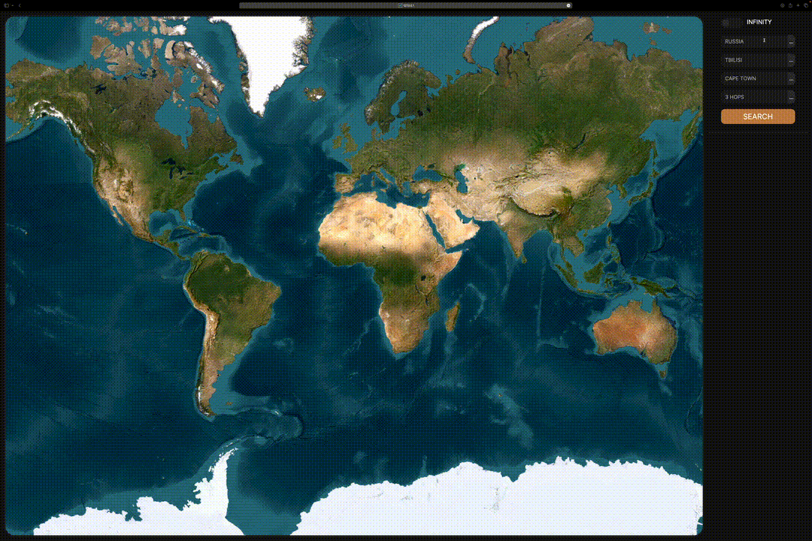

# TUDA - Flight Route Finder

TUDA is a cutting-edge web application designed to streamline the discovery of air travel routes. Utilizing interactive maps, it offers users a comprehensive view of flight routes, inclusive of potential stopovers and pricing details. The application supports two primary modes of operation: a direct search from point A to point B, and an "infinite search" mode, starting from a point A and revealing all conceivable subsequent routes without limiting the number of stopovers. A notable feature of TUDA is its intelligent search mechanism, which factors in the user's citizenship to exclusively showcase visa-free flights.

## Table of Contents

- [TUDA - Flight Route Finder](#tuda---flight-route-finder)
  - [Table of Contents](#table-of-contents)
  - [Features](#features)
  - [Service Demonstration](#service-demonstration)
  - [Technology Stack and Search Mechanism](#technology-stack-and-search-mechanism)
    - [Backend](#backend)
    - [Frontend](#frontend)
    - [Integration](#integration)
  - [Project Structure](#project-structure)
  - [Setup and Installation](#setup-and-installation)
  - [Contribution](#contribution)
  - [License](#license)

## Features

- **Interactive Route Display:** Utilizes dynamic maps to showcase flight routes, with detailed information on possible layovers and associated costs.
- **Dual Search Modes:** 
    - **Direct Search:** Directly finds routes from point A to point B.
    - **Infinite Search:** Begins at point A and uncovers endless subsequent routing options.
- **Citizenship-Aware Visa-Free Travel:** Tailors search results to the user's nationality, ensuring all displayed flight options are visa-free.

## Service Demonstration

## Technology Stack and Search Mechanism

### Backend

- **GoLang 1.21.1:** Employs GoLang for its robust backend functionalities, including the handling of API requests, server operations, and logic for calculating flight routes and prices.
- **Graph Algorithms:** At the heart of TUDA's search functionality is a sophisticated graph algorithm. This algorithm enables the efficient discovery of possible flight routes, accounting for direct and multi-stop journeys. By modeling airports as nodes and flights as edges, TUDA can quickly identify the most viable paths through a vast network of global flights, optimizing for criteria like cost and the absence of visa requirements.

### Frontend

- **Node.js 21.1.0 & React:** The frontend is developed with React, providing a responsive and dynamic user interface. Node.js serves as the runtime environment, ensuring seamless integration and performance.
- **Interactive Maps:** Leveraging advanced mapping technologies to render the routes and layovers interactively, enhancing user engagement and understanding of available flight paths.

### Integration

- **TravelPayouts API:** Integrates with the TravelPayouts API for up-to-date flight and route data. It's crucial to insert your TravelPayouts token in `main.go` at the designated "<TOKEN>" placeholder.

## Project Structure

- `cmd/`: Hosts the `main.go` entry point.
- `internal/`: Contains the application's core logic, including API endpoints, server functionality, and the service layer responsible for trip discovery and pricing calculations.
- `site/`: Houses the React-based frontend, including all user interface components, utilities, and services for backend communication.

## Setup and Installation

1. **Environment Setup:** Ensure GoLang 1.21.1 and Node.js 21.1.0 are installed on your system.
2. **API Token Configuration:** Insert your TravelPayouts API token in `main.go`.
3. **Building the Application:** Execute `make` to compile and prepare the project for launch.
4. **Launching the Server:** Run `./app` to initiate the server. Access the application at `127.0.0.1:8080/index.html`.

## Contribution

Contributions are welcome and greatly appreciated. You can contribute by submitting pull requests or opening issues for any bugs or feature suggestions.

## License

TUDA is released under the MIT License.
